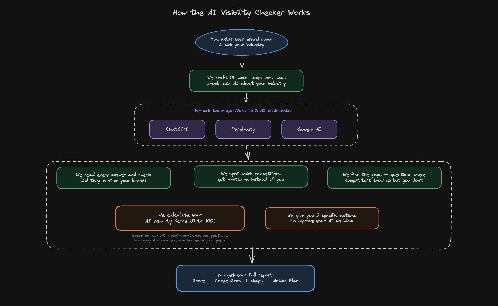

# Cited

> Find out if ChatGPT, Perplexity, and Google AI recommend your brand — in 60 seconds.

Built for Indian D2C brands who want to know where they stand in AI-powered search before their competitors figure it out.



---

## What It Does

You enter your brand name. We run 15 category-specific queries across 3 AI platforms simultaneously, detect where your brand appears (and where it doesn't), and return a scored report with competitor benchmarks and specific actions to improve.

**The output:**
- **AI Visibility Score** — 0 to 100, based on 4 weighted signals
- **Competitor comparison** — who the AIs recommend instead of you
- **Gap report** — the exact queries where competitors appear and you're missing
- **5 actionable recommendations** — tailored to your category and gaps

---

## How the Score Works

| Signal | Weight | What it measures |
|--------|--------|-----------------|
| Mention Frequency | 40% | % of queries where your brand is mentioned at all |
| Sentiment Quality | 20% | How positively the AI describes you (positive / neutral / negative) |
| Platform Coverage | 20% | How many of the 3 AI platforms mention you |
| Position Strength | 20% | How early in the answer your brand appears (1st = 1.0, 2nd = 0.5, etc.) |

---

## Tech Stack

| Layer | Technology |
|-------|-----------|
| Framework | Next.js 16 (App Router) + TypeScript |
| UI | shadcn/ui + Tailwind CSS v4 + recharts |
| Forms | react-hook-form + Zod |
| AI — ChatGPT | OpenAI API (`gpt-4o-mini`) |
| AI — Perplexity | Perplexity API (`sonar` model) |
| AI — Google AI | SerpAPI (Google AI Overviews, India locale) |
| Database | Neon (serverless PostgreSQL) |
| Cache | Upstash Redis (24hr TTL, optional) |
| Deployment | Vercel |

---

## Project Structure

```
src/
├── app/
│   ├── page.tsx                   # Main app — form, loading, results views
│   ├── layout.tsx                 # Root layout + metadata
│   └── api/audit/route.ts         # Core audit API — orchestrates everything
├── components/
│   └── audit/
│       ├── BrandInputForm.tsx     # Brand name, category, competitor inputs
│       ├── AuditProgress.tsx      # Animated loading state (6-step progress)
│       ├── ScoreCard.tsx          # SVG ring chart + score breakdown bars
│       ├── CompetitorChart.tsx    # Bar chart — your score vs competitors
│       ├── GapTable.tsx           # Table of queries you're missing from
│       └── RecommendationList.tsx # Expandable list of 5 actions
└── lib/
    ├── ai/
    │   ├── providers/
    │   │   ├── chatgpt.ts         # OpenAI provider
    │   │   ├── perplexity.ts      # Perplexity provider
    │   │   └── google-ai.ts       # SerpAPI provider
    │   ├── detection.ts           # Brand mention detection + 100+ known brands
    │   ├── prompts/categories.ts  # 120 India-focused prompts (15 × 8 categories)
    │   ├── scoring.ts             # Visibility score algorithm
    │   └── recommendations.ts    # Gap → action mapping
    ├── db/
    │   ├── neon.ts                # Neon client (lazy init)
    │   ├── schema.sql             # DB schema
    │   └── queries.ts             # CRUD helpers
    ├── cache/redis.ts             # Upstash Redis (optional, graceful fallback)
    └── utils/
        ├── constants.ts           # Categories, score weights, platforms
        └── validators.ts          # Zod schemas
```

---

## Getting Started

### 1. Clone and install

```bash
git clone https://github.com/your-username/cited.git
cd cited
npm install
```

### 2. Set up environment variables

```bash
cp .env.example .env.local
```

Fill in your keys:

```env
# Required — AI providers
OPENAI_API_KEY=sk-...
PERPLEXITY_API_KEY=pplx-...
SERPAPI_KEY=...

# Required — Database
DATABASE_URL=postgresql://...@...neon.tech/dbname?sslmode=require

# Optional — Caching (app works without it)
UPSTASH_REDIS_REST_URL=https://...upstash.io
UPSTASH_REDIS_REST_TOKEN=...
```

**Getting API keys:**
- [OpenAI](https://platform.openai.com/api-keys) — `gpt-4o-mini` (~$0.15 per audit)
- [Perplexity](https://www.perplexity.ai/settings/api) — `sonar` model
- [SerpAPI](https://serpapi.com/) — Google AI Overviews (100 free searches/mo)
- [Neon](https://neon.tech/) — free tier available
- [Upstash](https://upstash.com/) — free tier, optional

### 3. Set up the database

Run the schema against your Neon database:

```bash
psql $DATABASE_URL -f src/lib/db/schema.sql
```

### 4. Run locally

```bash
npm run dev
```

Open [http://localhost:3000](http://localhost:3000).

---

## Supported Categories

8 Indian D2C categories with 15 prompts each (120 total queries):

| Category | Example brands detected |
|----------|------------------------|
| Beauty & Skincare | mCaffeine, Minimalist, Mamaearth, Sugar Cosmetics |
| Food & Beverages | Licious, Country Delight, Vahdam, Yogabar |
| Health & Wellness | HealthKart, Plix, OZiva, MuscleBlaze |
| Fashion | Bewakoof, Snitch, The Souled Store, Rare Rabbit |
| Electronics & Gadgets | boAt, Noise, Fire-Boltt, Portronics |
| Baby Care | The Moms Co., Himalaya Baby, FirstCry |
| Home & Living | Wakefit, Sleepyhead, Duroflex, Pepperfry |
| Pet Care | Supertails, Heads Up For Tails, Wiggles |

---

## Deployment

### Deploy to Vercel

```bash
npm install -g vercel
vercel
```

Set the same environment variables in your Vercel project settings. The app runs entirely on serverless functions — no dedicated server needed.

---

## Cost per Audit

| Provider | Model | Cost per audit (~45 queries) |
|----------|-------|------------------------------|
| OpenAI | gpt-4o-mini | ~$0.10–0.15 |
| Perplexity | sonar | ~$0.05–0.10 |
| SerpAPI | Google AI Overviews | ~$0.05 (100 free/mo) |
| **Total** | | **~$0.20–0.30 per audit** |

Redis caching reduces repeat costs significantly — identical queries within 24h are free.

---

## Contributing

This project is open source and contributions are welcome.

**Good first issues:**
- Add more Indian D2C brands to the detection dictionary (`src/lib/ai/detection.ts`)
- Add new category prompts (`src/lib/ai/prompts/categories.ts`)
- Add support for a new AI platform provider (`src/lib/ai/providers/`)
- Improve the scoring algorithm weights

**To contribute:**
1. Fork the repo
2. Create a branch: `git checkout -b feature/your-feature`
3. Make your changes
4. Open a pull request

---

## License

MIT — use it, fork it, build on it.

---
